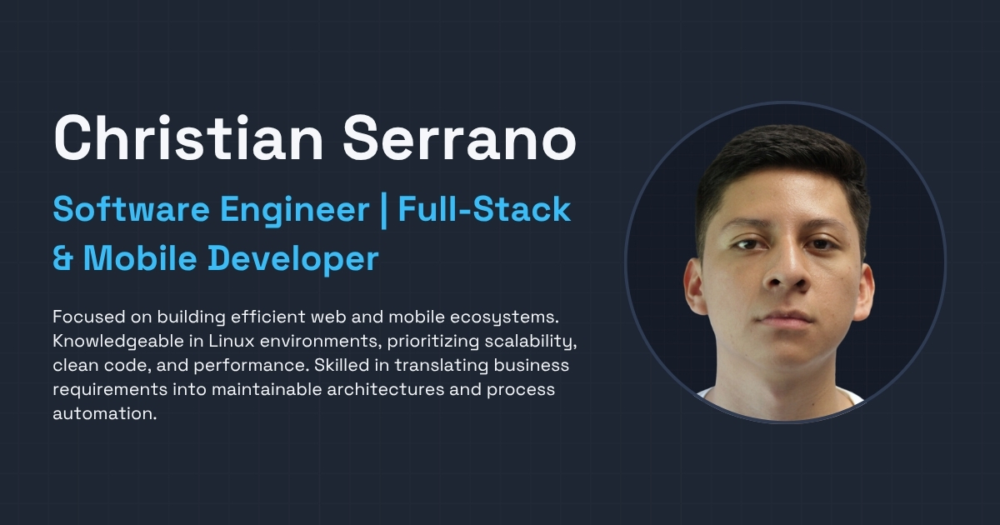

# Professional Portfolio | Christian Serrano



[](https://nextjs.org/)
[](https://www.typescriptlang.org/)
[](https://tailwindcss.com/)
[](https://opensource.org/licenses/MIT)

High-performance, multi-language professional portfolio built with a focus on clean architecture, accessibility, and modern user experience.

**Live Demo:** [chrisssp.vercel.app](https://chrisssp.vercel.app)

---

## Key Features

- **Full Internationalization (i18n):** Native support for English and Spanish with automated route detection and localized metadata.
- **Dynamic Open Graph Images:** Automated generation of social preview images (OG) using Edge Functions, customized for both the home page and individual projects.
- **Performance First:** Optimized Core Web Vitals, featuring real-time monitoring with Vercel Speed Insights.
- **Modern UI/UX:** Responsive, mobile-first design with dark/light mode support, featuring a custom "Smart Email Button" and blurred context-aware overlays.
- **Business Impact:** Showcasing technical solutions with real-world metrics (e.g., $2.3M USD reconciled, 95% process optimization).

---

## Tech Stack

- **Framework:** [Next.js 16](https://nextjs.org/) (App Router)
- **Language:** [TypeScript](https://www.typescriptlang.org/)
- **Styling:** [Tailwind CSS 4](https://tailwindcss.com/)
- **Icons:** [React Icons](https://react-icons.github.io/react-icons/)
- **Fonts:** [Space Grotesk](https://fonts.google.com/specimen/Space+Grotesk)
- **Deployment & Analytics:** [Vercel](https://vercel.com/) (Analytics & Speed Insights)

---

## Project Structure

```text
├── app/               # Next.js App Router (Layouts, Pages, OG Images)
├── components/        # Atomic Design structure (Atoms, Molecules, Organisms)
├── i18n/              # Translation modules and dictionary logic
├── public/            # Static assets (Images, Fonts, PDF CVs)
├── config/            # Global links and technology definitions
└── proxy.ts           # i18n middleware and routing logic
```

---

## Getting Started

1.  **Clone the repository:**
    ```bash
    git clone https://github.com/chrisssp/portfolio.git
    ```

2.  **Install dependencies:**
    ```bash
    pnpm install
    ```

3.  **Run the development server:**
    ```bash
    pnpm dev
    ```

4.  **Open [http://localhost:3000](http://localhost:3000)** in your browser.

---

## License

This project is licensed under the **MIT License** - see the [LICENSE](LICENSE) file for details.

> **Note:** All personal images, project descriptions, and brand assets are intellectual property of Christian Serrano. Feel free to use the code for learning purposes, but please do not replicate the personal content.

---

<p align="center">
    0 errors, 14 warnings, 100% by Christian Serrano 🤓👆
</p>
